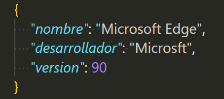
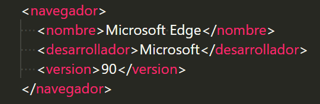
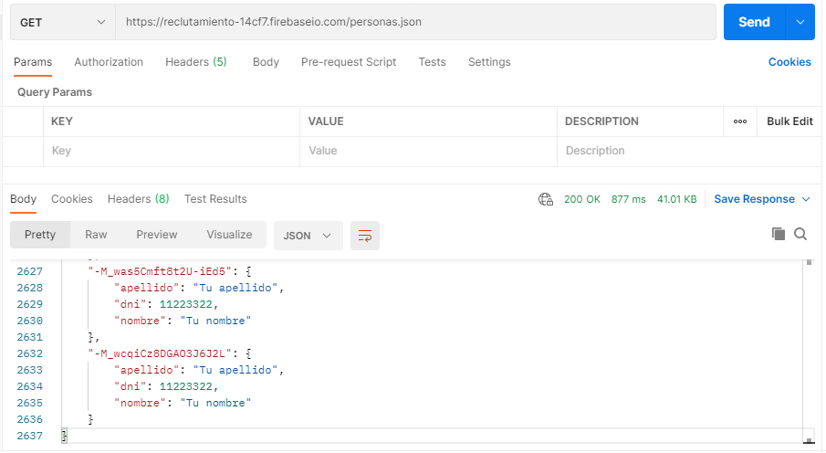
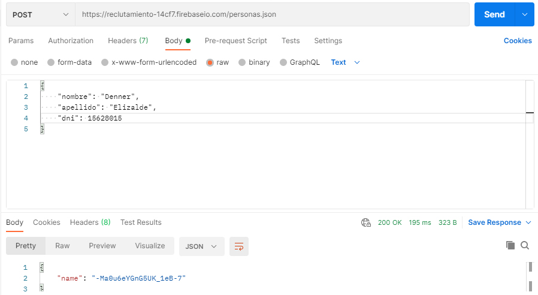
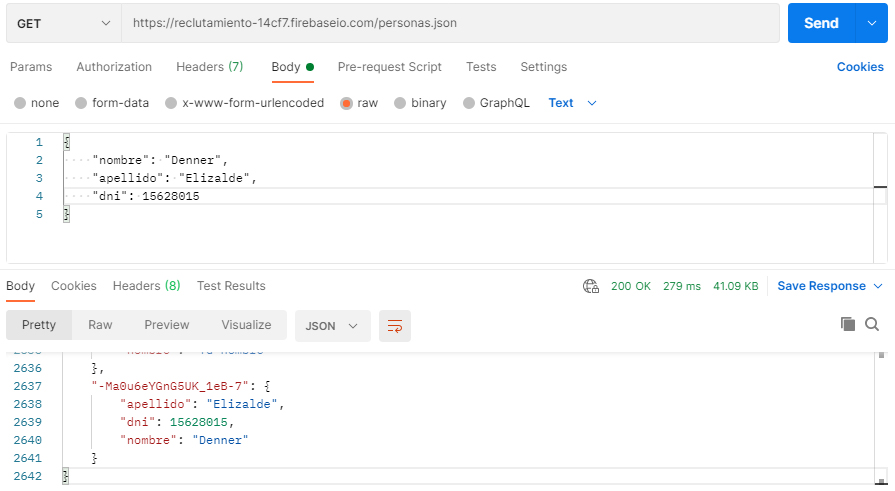
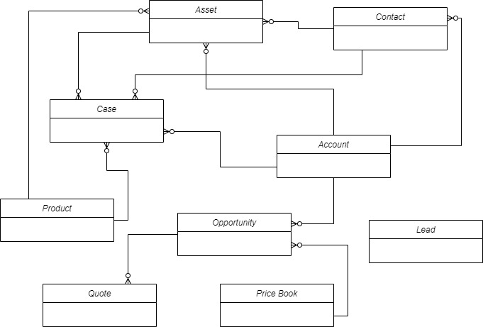

# **EVALUACIÓN PRÁCTICA**

## **EJERCICIO 2**

Las siguientes preguntas están orientadas a la comprensión del protocolo HTTP. Son agnósticas al lenguaje de programación, la idea es comprender los conceptos del estándar:

1. **¿Qué es un servidor HTTP?**
   Es aquel que aloja archivos web y permite que los clientes puedan acceder a ellos en cualquier momento y a través de un dominio.

2. **¿Qué son los verbos HTTP? Mencionar los más conocidos.**
   Permiten aplicar ciertas acciones a cualquier elemento web, como puede ser el envío o la recepción de información. Algunos de ellos son GET (para consultar un recurso como un sitio web), POST (permite guardar datos como los de un formulario) y PUT (actualiza recursos como la información de un usuario).

3. **¿Qué es un request y un response en una comunicación HTTP? ¿Qué son los headers?**
   Un request es cualquier petición que pueda realizar un cliente al servidor para acceder a un recurso, como una página web; mientras que un response es la respuesta que el servidor regresa al cliente, ya sea positiva (mostrar el recurso solicitado) o negativa (indicar un error).
   Los headers son utilizados para anexar información adicional dentro de un request o un response, como el verbo utilizado, el path (URL del recurso solicitado) y el protocolo empleado.

4. **¿Qué es un queryString? (En el contexto de una url).**
   Son los datos que se envían en una URL al momento de realizar un request.

5. **¿Qué es el responseCode? ¿Qué significado tiene los posibles valores devueltos?**
   Señalan el estado de un response, ya sea que se realizó correctamente o presentó algún error.
   Las pautas se dividen en respuestas informativas (de 100 a 199, la solicitud está en proceso); satisfactorias (de 200 a 299, la solicitud se realizó correctamente); redirecciones (de 300 a 399, se necesitan acciones adicionales para completar la solicitud); errores del cliente (de 400 a 499, la solicitud es rechazada por una falla cometida por el cliente) y errores del servidor (de 500 a 599, la solicitud es aceptada pero no completada por un problema en el servidor).

6. **¿Cómo se envía data en un Get y cómo en un POST?**
   Con el verbo GET, los datos se envían a través de la URL; mientras que con el verbo POST los datos se encuentran en el header del request, por lo que son prácticamente invisibles para el usuario.

7. **¿Qué verbo http utiliza el navegador cuando accedemos a una página?**
   Como mencioné en la pregunta 2, el verbo GET permite acceder a una página web o cualquier otro recurso.

8. **Explicar brevemente qué son las estructuras de datos JSON y XML dando ejemplo de estructuras posibles.**
   JSON define una sintaxis concreta para que la transferencia de datos entre el cliente y el servidor sea eficaz. Su estructura está basada en los objetos de JavaScript (de aquí proviene su nombre), compuestos por llaves y valores. A continuación, se muestra un ejemplo:
   
   
   
   XML es un lenguaje basado en etiquetas para ordenar información de manera jerárquica y optimizar su uso. El ejemplo utilizado anteriormente, pero en formato XML, sería el siguiente:
   
   
   
9. **Explicar brevemente el estándar SOAP.**
Es un protocolo con determinadas reglas para establecer una comunicación satisfactoria entre dos servicios web con lenguajes y plataformas diferentes.

10. **Explicar brevemente el estándar REST Full.**
REST está formado por un conjunto de principios flexibles para el intercambio de información en servicios web y aplicaciones móviles ligeras. A los servicios que utilizan esta arquitectura se les conoce como servicios RESTful

11. **¿Qué son los headers en un request? ¿Para qué se utiliza el key Content-type en un header?**
Los headers en un request agregan más detalles sobre la petición o ayudan a darle un mejor contexto. Algunos de ellos son host (dirección a la que va dirigida el request); user-agent (incluye el nombre y versión del navegador y del sistema operativo del usuario) y accept-language (lenguaje predeterminado del usuario).
El content-type, como su nombre lo indica, especifica al navegador el tipo de archivo que se va a consultar para que pueda interpretarlo de forma correcta.

### _**Fuentes consultadas**_
* Digital Guide IONOS. (2019). ¿Qué es un servidor web y qué soluciones de software existen?. 18 de mayo de 2021, de 1&1 IONOS. Sitio web: https://www.ionos.mx/digitalguide/servidores/know-how/servidor-web-definicion-historia-y-programas/
* MDN Web Docs. (2021). Que es un servidor WEB?. 18 de mayo de 2021, de Mozilla Corporation. Sitio web: https://developer.mozilla.org/es/docs/Learn/Common_questions/What_is_a_web_server
* MDN Web Docs. (2021). Métodos de petición HTTP. 18 de mayo de 2021, de Mozilla Corporation Sitio web: https://developer.mozilla.org/es/docs/Web/HTTP/Methods
* Victor Robles WEB. (2019). Métodos HTTP ¡EXPLICADOS! Diferencia entre GET, POST, PUT y DELETE. Crear un BACKEND RESTful. 18 de mayo de 2021, de YouTube. Sitio web: https://www.youtube.com/watch?v=dXF3cc8mkHM
* render2web. (2021). Petición y Respuesta Http - Request - Response PHP Video. 18 de mayo de 2021, de YouTube. Sitio web: https://www.youtube.com/watch?v=vs0ekUJ1rd8
* MDN Web Docs. (2021). HTTP headers. 18 de mayo de 2021, de Mozilla Corporation. Sitio web: https://developer.mozilla.org/es/docs/Web/HTTP/Headers
* GitBook. (s/f). Query String. 18 de mayo de 2021, de GitBook. Sitio web: https://analizador-lex-pjv.herokuapp.com/cookies/chapter3.html
* Lázaro, D. (2018). Códigos de estado HTTP. 18 de mayo de 2021, de Diego.com.es. Sitio web: https://diego.com.es/codigos-de-estado-http
* Penland, J. (2021). Una guía completa y una lista de códigos de estado HTTP. 18 de mayo de 2021, de Kinsta. Sitio web: https://kinsta.com/es/blog/codigos-de-estado-de-http/
* Digital Guide IONOS. (2020). HTTP Request: los métodos de petición que debes conocer. 18 de mayo de 2021, de 1&1 IONOS. Sitio web: https://www.ionos.es/digitalguide/hosting/cuestiones-tecnicas/http-request/#:~:text=HTTP%20Request%3A%20los%20métodos%20de,ha%20de%20responder%20el%20servidor.
* MDN Web Docs. (2021). Trabajando con JSON. 18 de mayo de 2021, de Mozilla Corporation. Sitio web: https://developer.mozilla.org/es/docs/Learn/JavaScript/Objects/JSON
* W3Schools. (s/f). JSON - Introduction. 18 de mayo de 2021, de W3Schools. Sitio web: https://www.w3schools.com/js/js_json_intro.asp
* González, R. (2021). ¿Qué es XML en programación? Te explicamos punto por punto de qué se trata esta herramienta. 18 de mayo de 2021, de Crehana. Sitio web: https://www.crehana.com/mx/blog/tech/que-es-xml/
* Red Hat. (s/f). Diferencias entre REST y SOAP. 18 de mayo de 2021, de Red Hat. Sitio web: https://www.redhat.com/es/topics/integration/whats-the-difference-between-soap-rest
* Chakray. (s/f). ¿Qué diferencias hay entre REST y SOAP?. 18 de mayo de 2021, de Chakray. Sitio web: https://www.chakray.com/es/que-diferencias-hay-entre-rest-y-soap/
* Guzel, B. (2021). Cabeceras HTTP para Dummies. 18 de mayo de 2021, de Envato. Sitio web: https://code.tutsplus.com/es/tutorials/http-headers-for-dummies--net-8039

## **EJERCICIO 3**
Recomendamos previamente entender los conceptos de la sintaxis “json” antes de arrancar con los ejercicios.
Descargar el POSTMAN (aplicación para realizar request como cliente), adjuntando un screen de resolución para cada ítem:
1. **Realizar un request GET a la URL: https://reclutamiento-14cf7.firebaseio.com/personas.json**


2. **Realizar un request POST a la URL anterior, y con body: {"nombre":"Tu nombre", "apellido":"Tu apellido", "dni":11223322} Tip: (Marcar la opción “raw” como body)**


3. **Realizar nuevamente un request GET a la URL: https://reclutamiento-14cf7.firebaseio.com/personas.json ¿Qué diferencias se observan?** Se agregaron mis datos al archivo JSON.


## **EJERCICIO 4**
Cambiar el idioma de Trailhead a inglés.
Realizar los siguientes módulos de Trailhead:
* Fundamento de la plataforma Salesforce
* Fundamentos de Apex y .NET
* Modelado de datos
* Fundamentos y base de datos de Apex
* Desencadenadores de Apex

Se recomienda usar el mismo Playground para todos módulos solicitados. Excepto que se solicite crear uno nuevo en el enunciado del Módulo.

Para revisar la resolución de los módulos compartir el perfil público de Trailhead en una liga dentro del Readme:
https://trailblazer.me/id/delizalde

## **EJERCICIO 5**
Explicar que son conceptualmente, qué datos almacenan en forma estándar y cómo se relacionan el resto (algunos no se relacionan entre sí) cada uno de los siguientes objetos de Salesforce:
1. **Lead.** Es un cliente potencial de la empresa. Sus campos requeridos por defecto son:
   * Company
   * Created by
   * Last modified by
   * Lead owner
   * Lead status
   * Name
2. **Account.** Es una cuenta de alguna persona relacionada a la empresa como un cliente, un competidor o un socio. Sus campos requeridos por defecto son:
   * Account name
   * Account owner
   * Created by
   * Last modified by
3. **Contact.** Es una persona relacionada a una Account. Sus campos requeridos por defecto son:
   * Contact owner
   * Created by
   * Last modified by
   * Name
4. **Opportunity.** Es una venta o acuerdo pendiente. Sus campos requeridos por defecto son:
   * Close date
   * Created by
   * Forecast category
   * Last modified by
   * Opportunity name
   * Opportunity owner
   * Probability
   * Stage
5. **Product.** Es un producto que ofrece la empresa a sus clientes. Sus campos requeridos por defecto son:
   * Created by
   * Last modified by
   * Product name
6. **PriceBook.** Es la lista de productos vendidos. Sus campos requeridos por defecto son:
   * Created by
   * Last modified by
   * Price book name
7. **Quote.** Es la cotización de un producto, es decir, el precio sugerido. Algunos de sus campos por defecto son:
   * Account id
   * Contact id
   * Last reference date
   * Name
   * Opportunity id
   * Price book id
8. **Asset.** Es un producto vendido por la empresa o un competidor. Sus campos requeridos por defecto son:
   * Asset name
   * Asset owner
   * Created by
   * Has lifecycle management
   * Last modified by
9. **Case.** Es un asunto o problema del cliente. Sus campos requeridos por defecto son:
   * Business hours
   * Case number
   * Case owner
   * Created by
   * Date/time opened
   * Last modified by
10. **Article.** No encontré información sobre este objeto en la documentación de Salesforce.



### _**Fuentes consultadas**_
* Salesforce developers. (2020). Standard Objects. 20 de mayo de 2021, de Salesforce. Sitio web: https://developer.salesforce.com/docs/atlas.en-us.object_reference.meta/object_reference/sforce_api_objects_list.htm

## **EJERCICIO 6**
Desarrollar un trigger para que cuando un usuario Modifica o Crea un contacto de Salesforce completando el campo generado el punto B con el ID del punto A, se invoque al Web Service con el idprocontacto obtenga los datos del nombre y el email de la respuesta y actualice el campo email del contacto. Usar Playground 1.

### Clase para obtener el e-mail
```
public class addEmail {
    @future(callout=true)
    public static void getEmail(String identifier) {        
        Http httpProtocol = new Http();
        HttpRequest request = new HttpRequest();
        String endpoint = 'https://procontacto-reclutamiento-default-rtdb.firebaseio.com/contacts.json';
        request.setEndPoint(endpoint);
        request.setMethod('GET');
        HttpResponse response = httpProtocol.send(request);
        System.debug(response.getBody());
        JSONParser parser = JSON.createParser(response.getBody());
        String email;
        while (parser.nextToken() != null) {
            if ((parser.getCurrentToken() == JSONToken.FIELD_NAME) && (parser.getText() == identifier)) {
                while (parser.nextToken() != JSONToken.END_OBJECT) {
                    if ((parser.getCurrentToken() == JSONToken.FIELD_NAME) && (parser.getText() == 'email')) {
                    	parser.nextToken();
                    	email = parser.getText();
                	}   
                }
            }
        }
    }   
}
```

### Trigger para insertar el e-mail
```
trigger TriggerEmail on Contact (after insert, after update) {
    for(Contact c : Trigger.New) {
        addEmail.getEmail(c.idprocontacto__c);
    }
}
```

## **EJERCICIO 7**
Responder las siguientes preguntas brevemente sobre:
### Soluciones de Salesforce
1. **¿Qué es Salesforce?** Es una plataforma que permite la gestión de procesos como ventas, servicios y marketing de una empresa de forma fácil e innovadora para brindar la mejor atención a sus clientes.
2. **¿Qué es Sales Cloud?** Es un producto Salesforce que administra los leads (clientes potenciales), monitorea resultados y automatiza ventas con ayuda de tecnologías como inteligencia artificial, big data y analytics.
3. **¿Qué es Service Cloud?** Es un producto Salesforce que brinda herramientas como gestión de casos, tickets de asistencias y base de conocimientos para dar seguimiento a los clientes de forma rápida y personalizada.
4. **¿Qué es Health Cloud?** Es un producto Salesforce enfocado a empresas del sector salud para el monitoreo de pacientes con el objetivo de ofrecer soluciones eficientes ante emergencias.
5. **¿Qué es Marketing Cloud?** Es un producto Salesforce que automatiza campañas publicitarias e interacciones con los clientes a través de distintos medios como redes sociales, e-mail y mensajes de texto.
### Funcionalidades de Salesforce
1. **¿Qué es un RecordType?** Define los valores que se pueden seleccionar cuando se desea crear un nuevo registro de cierto objeto.
2. **¿Qué es un ReportType?** Define los objetos y los campos de un nuevo reporte.
3. **¿Qué es un Page Layout?** Permite personalizar la página de registros de objetos, como la posición de botones y los campos que serán visibles, ocultos u obligatorios.
4. **¿Qué es un Compact Layout?** Muestra solo los campos importantes de un registro en formatos pequeños como la aplicación móvil de Salesforce y Lightning Experience.
5. **¿Qué es un Perfil?** Define las acciones permitidas en la aplicación que puede realizar un usuario, como qué datos u objetos puede editar o eliminar.
6. **¿Qué es un Rol?** Define el contenido que puede ver un usuario en la plataforma, como a qué registros tiene acceso y a cuáles no.
7. **¿Qué es un Validation Rule?** Verifica que se cumplan ciertas reglas antes de realizar cambios en un registro.
8. **¿Qué diferencia hay entre una relación Master Detail y Lookup?** En una relación master-detail existe mayor dependencia entre el objeto padre y el objeto hijo; si se borra al primero, el otro también se elimina porque se vuelve inutilizable. En cambio, en la relación lookup su dependencia es menor; si un objeto se va, el otro con modificaciones puede seguir funcionando.
9. **¿Qué es un Sandbox?** Es una copia de una organización Salesforce, utilizada principalmente para realizar cambios y pruebas sin poner en riesgo la integridad de los datos.
10. **¿Que es un ChangeSet?** Permite implementar cambios de una organización Salesforce a otra.
11. **¿Para qué sirve el import Wizard de Salesforce?** Importa datos y registros de datos de forma rápida y sencilla.
12. **¿Para qué sirve la funcionalidad Web to Lead?** Permite crear formularios que pueden ser insertados en cualquier sitio web y así obtener información sobre nuevos leads.
13. **¿Para qué sirve la funcionalidad Web to Case?** Permite crear formularios que pueden ser insertados en cualquier sitio web y así obtener reportes o problemas de los clientes.
14. **¿Para qué sirve la funcionalidad Omnichannel?** Enlaza los casos de trabajo al empleado mejor capacitado y que se encuentre disponible en el momento.
15. **¿Para qué sirve la funcionalidad Chatter?** Es una red social que conecta a todos los usuarios de la empresa en Salesforce y permite el trabajo colaborativo desde cualquier lugar.
### Conceptos generales
1. **¿Qué significa SaaS? ¿Salesforce es Saas?** Es cualquier aplicación que puede ser utilizada con solo tener conexión a internet y sin instalar algún software o complemento, como Salesforce.
2. **¿Que significa que una solución sea Cloud?** Cualquier sistema o información es accesible a través de internet a cualquier hora y momento, eliminando problemas de movilidad y almacenamiento físicos.
3. **¿Que significa que una solución sea On-Premise?** La información es almacenada en servidores locales y tanto el control como la seguridad de la misma queda a cargo de la empresa. 
4. **¿Que es un pipeline de ventas?** Es la serie de acciones que se emplean para convertir a un lead en un cliente.
5. **¿Que es un funnel de ventas?** Es la estadística que muestra el porcentaje de leads que se convirtieron en clientes y la efectividad de cada una de las acciones realizadas en el pipeline. 
6. **¿Qué significa Customer Experience?** Es la imagen que genera una empresa en sus clientes tras una interacción y siempre busca que ésta sea positiva.
7. **¿Qué significa omnicanalidad?** Es la relación estrecha que se crea entre la empresa y los clientes y que perdura sin importar el cambio de sus necesidades.
8. **¿Qué significa que un negocio sea B2B?** Los productos o servicios de una empresa son dirigidos a otras empresas. 
9. **¿Qué significa que un negocio sea B2C?** Los productos o servicios de una empresa son dirigidos al público en general.
10. **¿Qué es un KPI?** Es un indicador para medir el desempeño de una empresa, un proyecto o algún empleado en relación con las metas u objetivos planteados.
11. **¿Qué es una API y en qué se diferencia de una Rest API?** Una API es un conjunto de reglas que permite la comunicación entre dos aplicaciones de manera flexible, mientras que una Rest API es el conjunto de reglas que definen el diseño de la arquitectura de una API.
12. **¿Qué es un Proceso Batch?** Aquel que puede ejecutarse con poca o nula interacción del usuario final.
13. **¿Qué es Kanban?** Es una metodología que permite observar el progreso de tareas (por hacer, en proceso o finalizadas) de forma visual (tarjetas).
14. **¿Qué es un ERP? ¿Salesforce es un ERP?** Es un software que optimiza la administración de diversos departamentos de una empresa como recursos humanos, finanzas, abastecimiento y gestión de riesgos. Salesforce no es un ERP porque está mayormente enfocado en las ventas y la relación con sus clientes.

### _**Fuentes consultadas**_
* Salesforce. (2017). ¿Qué es Salesforce?. 21 de mayo de 2021, de Salesforce. Sitio web: https://www.salesforce.com/mx/products/what-is-salesforce/
* Salesforce Latin America. (2016). ¿Qué es Salesforce?. 21 de mayo de 2021, de YouTube. Sitio web: https://www.youtube.com/watch?v=E-W2ILiRLnk
* Salesforce. (2017). Sales Cloud. 21 de mayo de 2021, de Salesforce. Sitio web: https://www.salesforce.com/mx/products/sales-cloud/overview/#:~:text=Sales%20Cloud%20es%20un%20software,necesitas%20en%20una%20única%20plataforma.
* Salesforce. (2017). Service Cloud. 21 de mayo de 2021, de Salesforce. Sitio web: https://www.salesforce.com/mx/products/service-cloud/overview/
* Salesforce. (2017). Health Cloud. 21 de mayo de 2021, de Salesforce. Sitio web: https://www.salesforce.com/mx/products/health-cloud/overview/
* Salesforce. (2017). Marketing Cloud. 21 de mayo de 2021, de Salesforce. Sitio web: https://www.salesforce.com/mx/products/marketing-cloud/overview/
* Trailhead. (2021). Create Record Types. 21 de mayo de 2021, de Salesforce. Sitio web: https://trailhead.salesforce.com/en/content/learn/projects/customize-a-salesforce-object/create-record-types
* Salesforce developers. (2020). ReportType. 21 de mayo de 2021, de Salesforce. Sitio web: https://developer.salesforce.com/docs/atlas.en-us.api_meta.meta/api_meta/meta_reporttype.htm#stq=Page%20Layout&stp=1
* Salesforce Trailblazer Community. (2020). Page Layouts. 21 de mayo de 2021, de Salesforce. Sitio web: https://help.salesforce.com/articleView?id=customize_layout.htm&type=0
* Salesforce Trailblazer Community. (2020). Compact Layouts. 21 de mayo de 2021, de Salesforce. Sitio web: https://help.salesforce.com/articleView?id=sf.compact_layout_overview.htm&type=5
* Salesforce Trailblazer Community. (2020). Profiles. 21 de mayo de 2021, de Salesforce Sitio web: https://help.salesforce.com/articleView?id=sf.admin_userprofiles.htm&type=5
* Salesforce Trailblazer Community. (2020). Create a User Role. 21 de mayo de 2021, de Salesforce. Sitio web: https://help.salesforce.com/articleView?id=sf.admin_roles.htm&type=5
* Trailhead. (2021). Create Object Relationships. 21 de mayo de 2021, de Salesforce. Sitio web: https://trailhead.salesforce.com/en/content/learn/modules/data_modeling/object_relationships
* Salesforce Trailblazer Community. (2020). When to Use a Sandbox. 21 de mayo de 2020, de Salesforce. Sitio web: https://help.salesforce.com/articleView?id=sf.deploy_sandboxes_intro.htm&type=5
* Salesforce Trailblazer Community. (2020). Change Sets. 21 de mayo de 2021, de Salesforce. Sitio web: https://help.salesforce.com/articleView?id=sf.changesets.htm&type=5
* Salesforce Trailblazer Community. (2020). Data Import Wizard. 21 de mayo de 2021, de Salesforce. Sitio web: https://help.salesforce.com/articleView?id=sf.data_import_wizard.htm&type=5
* Salesforce. (2021). Web-to-Lead in Salesforce. 21 de mayo de 2021, de Salesforce. Sitio web: https://www.salesforce.com/products/guide/lead-gen/web-to-lead/
* Salesforce Trailblazer Community. (2020). Set Up Web-to-Case. 21 de mayo de 2021, de Salesforce. Sitio web: https://help.salesforce.com/articleView?id=sf.setting_up_web-to-case.htm&type=5
* Salesforce Trailblazer Community. (2020). Omni-Channel. 21 de mayo de 2021, de Salesforce. Sitio web: https://help.salesforce.com/articleView?id=sf.omnichannel_intro.htm&type=5
* Salesforce. (2017). Chatter. 21 de mayo de 2021, de Salesforce. Sitio web: https://www.salesforce.com/mx/products/chatter/overview/
* Salesforce. (2017). SaaS. 21 de mayo de 2021, de Salesforce. Sitio web: https://www.salesforce.com/mx/saas/
* Salesforce. (2017). Cloud Computing. 21 de mayo de 2021, de Salesforce. Sitio web: https://www.salesforce.com/mx/cloud-computing/#:~:text=De%20una%20manera%20simple%2C%20la,computadora%20personal%20o%20servidor%20local.
* Digital Guide IONOS. (2020). On-premises: el modelo de software basado en el servidor. 21 de mayo de 2021, de 1&1 IONOS. Sitio web: https://www.ionos.mx/digitalguide/servidores/know-how/que-es-on-premises/
* Goldstein, B. (s/f). Do you know the difference between a sales pipeline and a sales funnel?. 21 de mayo de 2021, de Nutshell. Sitio web: https://www.nutshell.com/blog/sales-pipeline-vs-funnel/
* Russo, A. (2021). Customer Experience: lo qué es y cómo está relacionado con tu estrategia de Inbound Marketing. 21 de mayo de 2021, de RD Station. Sitio web: https://www.rdstation.com/mx/blog/customer-experience/
* Samsing, C. (2021). Omnicanalidad: 12 ejemplos excepcionales de estrategias omnicanal. 21 de mayo de 2021, de HubSpot. Sitio web: https://blog.hubspot.es/service/ejemplos-excepcionales-experiencia-omnicanal
* Juan, C.. (2016). Diferencias entre el Marketing B2C y B2B. 21 de mayo de 2021, de IEBS. Sitio web: https://www.iebschool.com/blog/diferencias-entre-b2b-y-b2c-marketing-estrategico/
* EAE Business School. (2020). Ejemplos de KPIS que aplicar en tu empresa. 21 de mayo de 2021, de EAE Business School Sitio web: https://retos-directivos.eae.es/algunos-ejemplos-de-kpis-que-puedes-aplicar-en-tu-empresa/
* Fernández, Y. (2019). API: qué es y para qué sirve. 23 de mayo de 2021, de Xataka Sitio web: https://www.xataka.com/basics/api-que-sirve
* GitBook. (s/f). Creación de una API. 23 de mayo de 2021, de GitBook Sitio web: https://juanda.gitbooks.io/webapps/content/api/arquitectura-api-rest.html
* IBM Corporation. (s/f). What is batch processing?. 21 de mayo de 2021, de IBM. Sitio web: https://www.ibm.com/docs/es/zos-basic-skills?topic=jobs-what-is-batch-processing
* Gilibets, L. (2020). Qué es la metodología Kanban y cómo utilizarla. 21 de mayo de 2021, de IEBS Sitio web: https://www.iebschool.com/blog/metodologia-kanban-agile-scrum/
* Oracle. (2021). ¿Qué es ERP?. 21 de mayo de 2021, de Oracle. Sitio web: https://www.oracle.com/mx/erp/what-is-erp/
